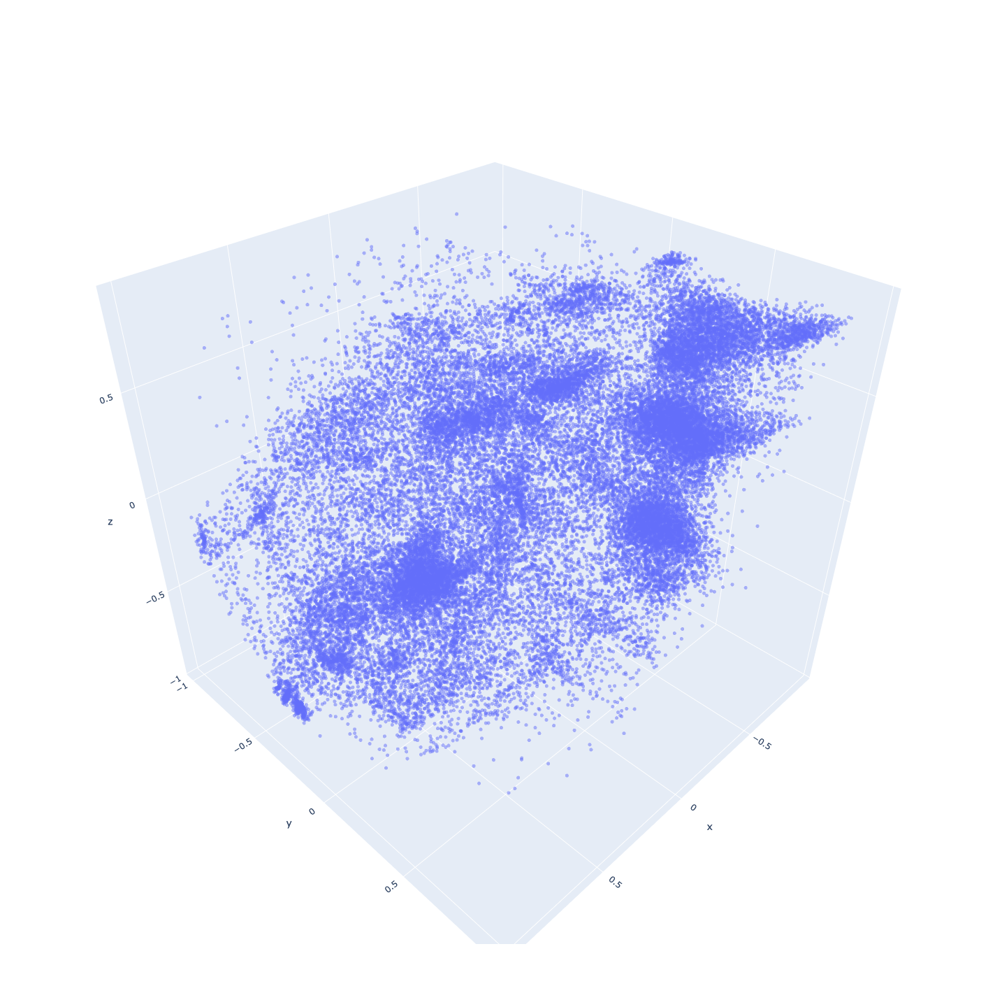
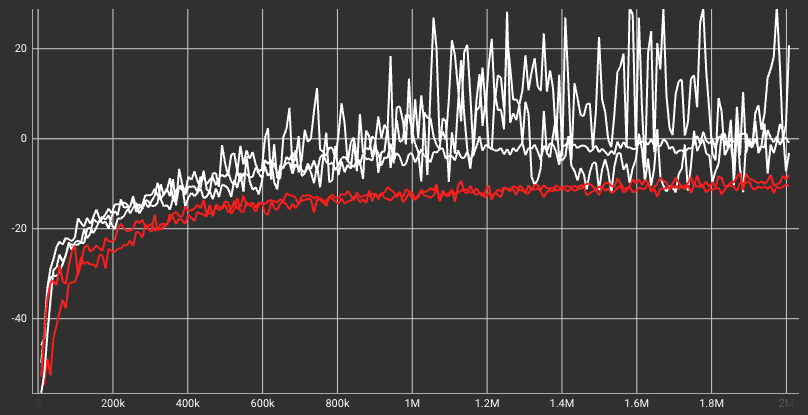

# Autoencoder-based skill embeddings with residual connections
### Currently work in progress!
### Right now the code is very unorganized and split across a lot of different branches, will try to organize everything + do more experiments soon

## The idea
I first train an agent on a simple low-level environment. Then, the agent’s actions are mapped to
a latent space smaller than the agent’s action space using a deep autoen-
coder. The decoder part of the autoencoder is then embedded into a harder
environment, lowering the action space for the high-level agent. Most no-
tably, however, the autoencoder architecture includes residual connections
from the original state to the decoder, allowing for a deeper, more accurate
skill representations without complicating the high-level policy. Tests show
that after the basic latent space has been developed, my method outperforms
classic RL algorithms.

# Autoencoder Architecture

# Autoencoder latent space plot

## Experiments
### Panda arm, pick & place
[cite bullet-panda here] 
panda-gym is a PyBullet-based set of environments revolving around the Panda robotic arm.
I designed a custom environment where the robot has to pick up an object. The rewards are dense, where the robot receives penalty for being farther away
from the object and adding a big reward for when the object is lifted up 0.1 m.

white = skill embeddings with residual connection in autoencoder, red = vanilla skill embeddings