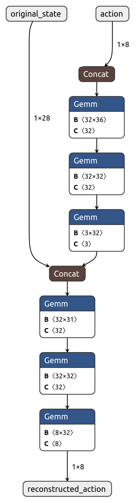

# Autoencoder-based skill embeddings with residual connections
### Currently work in progress!
### Right now the code is very unorganized and split across a lot of different branches, will try to organize everything + do more experiments soon

## The idea
I first train an agent on a simple low-level environment. Then, the agent’s actions are mapped to
a latent space smaller than the agent’s action space using a deep autoen
coder. The decoder part of the autoencoder is then embedded into a harder
environment, lowering the action space for the high-level agent. Most no
tably, however, the autoencoder architecture includes residual connections
from the original state to the decoder, allowing for a deeper, more accurate
skill representations without complicating the high-level policy. Tests show
that after the basic latent space has been developed, my method outperforms
classic RL algorithms.

## Method 
My algorithm consists of two stages: the low-level learning stage, where basic
motor skills are developed by the agent and converted into a latent space,
and the high-level learning stage, where a different policy is trained using
the reduced action size to traverse a more complex environment.  
During the first stage of the algorithm, the low-level policy is trained with a
standard RL algorithm, such as PPO. Then, the agent’s states and actions
are logged for some number of timesteps as data for the autoencoder. I found
that having smaller episode lengths during the logging stage allows for better
sampling of movement and better autoencoder performance.  
The autoencoder is then trained on the logged data. My algorithm uses a
modified version of an autoencoder. The encoder takes the action taken and outputs a compressed latent space. Instead of receiving
just the compressed latent space as an input, the decoder also takes in the original state before the action, which allows the
decoder to have more relevant input information while not sacrificing high-
level agent training performance.  
Lastly, a high-level agent is trained on the latent space of the autoencoder, allowing for a smaller action space, which makes the agent learn complex behavior more quickly.  
Overall, variations of this algorithm without embedding the original state in the decoder input are well studied [citation needed].

# Autoencoder Architecture

# Autoencoder latent space plot

## Experiments
### Panda arm, pick & place
[cite bullet-panda here] 
panda-gym is a PyBullet-based set of environments revolving around the Panda robotic arm.
I designed a custom environment where the robot has to pick up an object. The rewards are dense, where the robot receives penalty for being farther away
from the object and adding a big reward for when the object is lifted up 0.1 m.

white = skill embeddings with residual connection in autoencoder, red = vanilla skill embeddings